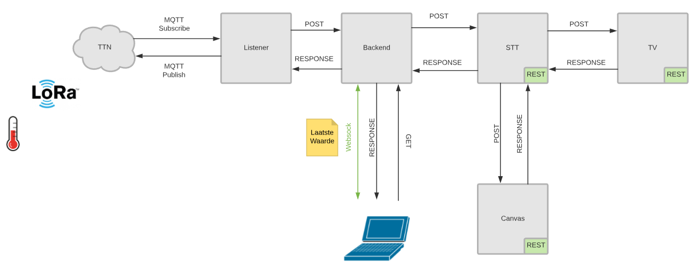
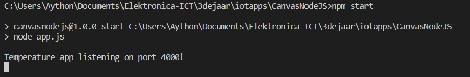
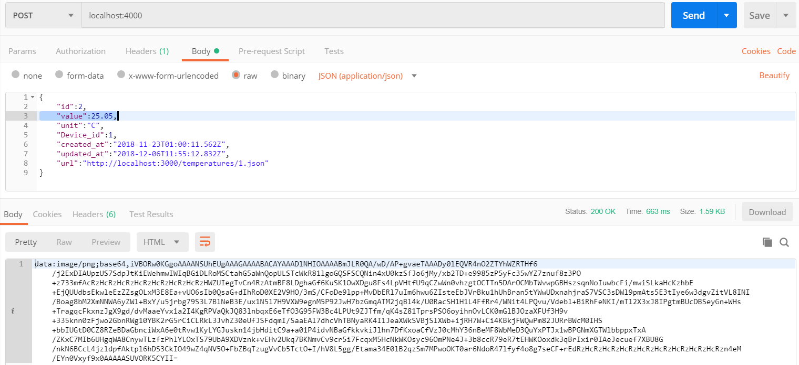
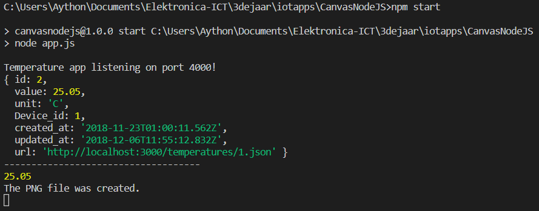

# Canvas in NodeJS

Using canvas to create image of data received from STT and responds with the base64 code of the image.



The image that has been created with the data of STT.


## Getting Started

The following instructions will get you a copy of the project up and running on your local machine for development and testing purposes.

cloning the repository:

```git clone git@github.com:vives-iotapplications-2018/CanvasNodeJS.git```

```npm install``` 

command to run the script

```npm start```



The app is a server that is waiting on a received post request and then an image is made with the value in the post request. The answer is the base64 code of the image.

You can simulate a post request with postman.



In the console you get the body of the post request.



The generated image:

