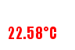
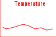

# Canvas in NodeJS

Using canvas to create image




```npm install``` 

```npm install canvas```

```npm install express --save```

```npm install body-parser```


data received from ttn 0xFF 0XFF /100


payload format in ttn console

```
function Decoder(bytes, port) {
    // Decode an uplink message from a buffer
    // (array) of bytes to an object of fields.
    var decoded = {};
    
    // Decode bytes to int
    var temperature = (bytes[0] & 0x80 ? 0xFFFF<<16 : 0) | bytes[0]<<8 | bytes[1];;
    
    // Decode int to float
    decoded.temperature = temperature / 100;
    
    
    return decoded;
    }
```